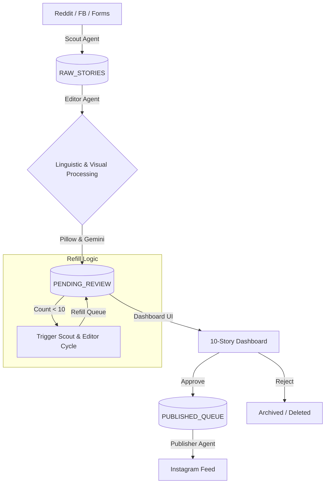

# Project Swayam-Admin: Autonomous NRI Confessions Engine

## 1. Project Overview

Project **Swayam-Admin** is an end-to-end autonomous AI system designed to manage a high-engagement Instagram brand targeting the NRI (Non-Resident Indian) diaspora. The system acts as a digital administrator, handling content discovery, curation, linguistic adaptation (Tanglish), graphic generation, and page management with minimal human intervention.

### Core Objective
To reach **100,000 followers** through hyper-relatable, authentic-looking "paper-style" confession posts, utilizing a "Human-in-the-Loop" dashboard to ensure quality and brand safety.

---

## 2. System Architecture

### A. The Scout Agent (Research & Discovery)
Unlike standard scrapers, this agent hunts for "Hidden Gems" rather than viral content to avoid being perceived as a Reddit mirror.
* **Targets:** Reddit (specific subreddits), Facebook Groups, and the proprietary User Submission Form.
* **Filters:**
  * *Reddit Rising:* Target posts with 20–150 upvotes (validated but not yet mainstream).
  * *Comment Mining:* Extracts first-person anecdotes from large discussion threads.
  * *Keyword Guard:* Matches against NRI life-stages (*H1B, OPT, Roommates, Pelli, Desi-Groceries*).
* **De-duplication:** Uses Vector Embeddings (Semantic Search) to ensure the same story isn't processed twice.

### B. The Editor Agent (Linguistic & Visual Processing)
The heart of the "Cultural Intelligence" engine.
* **Hybrid Processing (Tanglish):** Uses Gemini 1.5 Flash to rewrite raw English or Telugu text into a natural-sounding mixture (e.g., *"Manager toh argument start aindi, then he said my performance is low."*).
* **Tone Tuning:** Injects regional NRI slang based on the detected location (e.g., *Dallas, New Jersey, London*).
* **Graphic Rendering:** Programmatically overlays the processed text onto high-quality paper/notebook textures using the Python Pillow library.

### C. The Command Center (The 10-Story Dashboard)
A custom-built UI that maintains a steady state of 10 ready-to-review posts.
* **State Logic:** If `count(pending_review) < 10`, the system automatically triggers a new *Research -> Edit* cycle to refill the queue.
* **Actions:** *Approve* (moves to schedule), *Reject* (archives/deletes), *Edit* (manual tweak).

---

## 3. Phased Implementation Plan

### Phase 1: Infrastructure & Branding (Days 1-3)
* **Account Setup:** Create Instagram Professional account linked to a Facebook Page.
* **Identity Agent:** Run Gemini to generate the brand name, bio, and visual identity.
* **Graphic Persona:** Generate the "Paper Texture" library and "Handwritten" font assets.
* **API Access:** Secure Meta Graph API tokens and Reddit PRAW credentials.

### Phase 2: The Data Pipes & Refill Logic (Days 4-7)
* **Ingestion:** Build the Google Forms listener and the Reddit "Hidden Gem" scraper.
* **Database Setup:** Initialize Supabase with tables for `RAW_STORIES`, `PENDING_REVIEW`, and `PUBLISHED_QUEUE`.
* **The Refill Trigger:** Write a CRON job/Cloud Function that monitors the database count and triggers the Agentic workflow to maintain exactly 10 stories in the `PENDING_REVIEW` table.

### Phase 3: The Tanglish Engine (Days 8-12)
* **Prompt Engineering:** Develop the "Cultural Intelligence" prompt for Gemini that handles the English-Telugu-Hybrid transliteration.
* **Image Pipeline:** Build the Python script that takes text + background texture and outputs a squared Instagram-ready JPG.
* **Auto-Captioning:** AI generates 3 caption variants with a mix of static and trending hashtags.

### Phase 4: Dashboard & Publishing (Days 13-17)
* **Dashboard UI:** Build a simple Next.js/Tailwind CSS app to view the 10 story cards.
* **Integration:** Connect Dashboard buttons to Supabase status updates.
* **The Publisher:** Implement the Meta Graph API logic to post the "Approved" stories at peak NRI activity times (Logic based on follower timezones).

### Phase 5: Engagement & Growth (Days 18+)
* **Comment Bot:** Set up ManyChat or custom automation to respond to comments and drive story views.
* **Growth Agent:** The AI reviews previous post reach once a week and adjusts the "Hunting" keywords to favor what is currently trending.

---

## 4. Technical Stack

* **Languages:** Python (Backend/Agents), TypeScript (Frontend/Dashboard).
* **Frameworks:** FastAPI (Agent orchestration), Next.js (Dashboard).
* **AI Models:** Gemini 1.5 Flash (Text/Reasoning), Gemini 3 Flash Image (Branding/DP).
* **Database:** Supabase (Postgres) for state management and data storage.
* **Deployment:** Google Cloud Run (Serverless execution).

---

## 5. Security & Guardrails

* **Anonymity:** Absolute stripping of PII (Personally Identifiable Information) before the story hits the Dashboard.
* **Legal:** AI-driven redaction of specific company names or real names to prevent defamation.
* **Safety:** Content Moderation API layer to filter out explicit or harmful content during ingestion.
